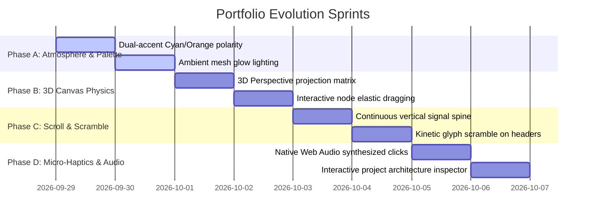

# Assemble: Motion Design & Visual UX Master Critique & Evolution Blueprint

> **Project:** Shreyas Mudholkar Portfolio ([`my_webpage`](https://github.com/Shreyas-cpu/my_webpage))  
> **Auditor Role:** Senior UI Motion Designer & Creative Technologist  
> **Date:** September 2026  
> **Target Caliber:** Awwwards Site of the Day / FWA Quality Enterprise AI Showcase

---

## 1. Executive Summary & Aesthetic Assessment

The current portfolio possesses a remarkably strong foundation: it is blazing fast (sub-second Vite build), semantically structured, fully accessible, and unified under the conceptual thesis of **"LLM ↔ MCP ↔ SAP Enterprise Routing."** 

However, when evaluated against award-winning interactive engineering portfolios (such as Linear, Stripe, Apple Developer, and Bruno Simon), the site currently sits at the boundary between a **"very clean, polished developer site"** and a **"breathtaking, cinematic creative experience."**

```
CURRENT STATE: High Polish (8.2/10)
  ├── Fast 60 FPS Canvas
  ├── Restrained 3D Card Tilt
  └── Clean Semantic Layout

TARGET STATE: Elite Creative Engineering (9.8/10)
  ├── Volumetric Atmospheric Depth (Dual-tone lighting)
  ├── 3D Rotational Canvas Mesh with Spring Physics
  ├── Continuous Vertical Signal Conduits across Scroll
  └── Kinetic Glyph Decryption & Web Audio Micro-Haptics
```

---

## 2. Deep Dive: Color Palette & Atmospheric Depth

### Current Palette Analysis
- **Base Ink:** `#0B0E14` (Deep Charcoal Blue)
- **Paper Text:** `#EDEFF3` (Off-White)
- **Primary Signal:** `#FF8A3D` (Warm Copper / Orange)
- **Border Line:** `#263142` (Dark Steel)

### The Critique
1. **Monotony in Extended Scroll Sessions:** Because the entire background relies on a single accent tone (`#FF8A3D`) against a dark neutral, long scroll sessions begin to feel visually uniform. There is no sense of "moving between architectural tiers."
2. **Lack of Volumetric Depth:** The background is relatively flat. While there is a radial gradient in the hero, deeper sections like Leadership and Education lack atmospheric ambient light, creating "black dead zones."

### The Recommendation: Polarity & Volumetric Layering
1. **Introduce a Secondary Cold Polarity (`#00F0FF` Cyber Cyan or `#38BDF8` Aurora Blue):**
   - **Thesis:** Enterprise systems are dual-natured. Cold infrastructure (SAP OData, Kubernetes, databases) meets warm generative intelligence (LLMs, neural dispatch, human decisions).
   - Use `#FF8A3D` for **Intelligence / Triage / Action**.
   - Use `#00F0FF` for **Data Bus / SAP Queries / Telemetry Transits**.
   - Visualizing packets shifting color as they pass through the MCP gateway (from Cyan to Orange) instantly tells an intuitive visual story.
2. **Volumetric Ambient Blobs (GPU Mesh Lighting):**
   - Place two slowly orbiting radial blur spheres (`backdrop-filter: blur(80px)`) that drift in the background with continuous low-frequency Perlin noise, creating the illusion of living server room ambient lighting.

---

## 3. Signature Hero & Canvas Topology

### Current Topology
- 2D coordinate-based canvas network with animated edge pulses, proximity hover rings, and pointer parallax.

### What It Lacks
- While responsive and crisp, the canvas is purely 2D planar. Moving the mouse tilts coordinates slightly, but the nodes do not rotate around a true 3D spatial center.
- Node packets move at constant speeds; they lack kinetic inertia or physics-based arrival moments.

### The Recommendation: 3D Spatial Matrix & Interactive Fling
1. **True 3D Pitch/Yaw Matrix Projection:**
   - Add a lightweight `Z` axis to all nodes. When the user tilts their mouse, calculate a true 3D perspective rotation matrix ($X, Y, Z \rightarrow X', Y'$ with foreshortening scale). Nodes in the background appear smaller and dimmer, while foreground nodes glow brightly.
2. **Interactive Node Physics (Click & Drag):**
   - Enable users to click and drag any node (e.g. dragging the `MCP Gateway` node). Connected edges should stretch like rubber elastic bands and snap back with a dampened spring (`stiffness: 180, damping: 14`).
3. **Data Packet Comet Tails:**
   - Replace circular dot pulses with directional luminous comet trails that leave a fading tail along the circuit wires, reinforcing high-bandwidth enterprise throughput.

---

## 4. Scroll Choreography & Visual Narrative

### Current Transitions
- GSAP ScrollTrigger reveals elements individually using `power3.out` from `y: 28px` to `0`.
- Section dividers feature a discrete horizontal line with a pulse dot.

### What It Lacks
- Sections feel like stacked islands. The user reads one block, crosses a divider, and reads the next. There is no unbroken physical metaphor connecting the Hero down to the Contact footer.

### The Recommendation: The Continuous Signal Highway
1. **The Vertical Spine Rail (Left Margin Bus):**
   - Render a vertical optical bus line along the left edge of the screen (or adjacent to section numbers).
   - As the user scrolls, a glowing laser beam tracks the exact scroll progress, branching out 90-degree circuit traces into section headings as each section activates.
2. **Kinetic Inertia (Scroll Velocity Skew):**
   - Use Lenis's `scroll.velocity` callback to apply subtle micro-skew (e.g., `skewY(-0.8deg)` on fast downward scroll, springing back to `0deg` on stop). This makes the interface feel tactile and weighted, like real physical parchment.
3. **Parallax Layer De-synchronization:**
   - Section numbers (`01`, `02`, `03`) should scroll 20% slower than body text, giving the impression that the section headings are carved into the deep background while project cards float above.

---

## 5. Component Tactility & Micro-Interactions

### Current State
- Cards have 3D mouse tilt and a radial glare overlay.
- Cursor morphs from dot to reticle.

### What It Lacks
- Interactive feedback is visual-only and silent.
- Headings and labels appear statically without dramatic entrance flourishes.
- Cards display text facts but do not offer interactive discovery modes.

### The Recommendation: Cyber-Enterprise Polish
1. **Kinetic Glyph Decryption (Hacker Text Scramble):**
   - When section titles enter view (`The Integration Layer`, `Enterprise Systems in Production`), the characters should rapidly scramble through random hex/symbol runes (`0x7F`, `//`, `_`, `%`) for 350ms before resolving into crisp English text.
2. **Project Card Architecture Inspector (Interactive Flow):**
   - Clicking a node in the card's pipeline circuit (`APEX → ORACLE → NEXUS → HELIX`) should actively illuminate that engine's specific responsibilities in a mini-telemetry drawer below the card description.
3. **Web Audio Micro-Haptics (Optional Ambient Audio):**
   - Built entirely in vanilla JS via the browser's native `AudioContext` (0kb extra bundle size).
   - Extremely soft, sub-bass mechanical click (`40Hz`, 6ms duration) on card hover.
   - High-frequency digital ping (`2400Hz`, 8ms duration) on anchor clicks.
   - Includes a prominent global sound toggle in the header (`[AUDIO: ON/OFF]`), default muted.

---

## 6. Actionable Implementation Sprints



### Sprint 1: Atmospheric Depth & Color Grading
- [ ] Inject `--color-signal-cyan: #00F0FF` alongside `--color-signal: #FF8A3D` in `src/index.css`.
- [ ] Add dual-color data packets in `HeroNetwork.tsx` (Cyan = Inbound SAP Queries, Orange = Outbound LLM Decisions).
- [ ] Add soft drifting ambient blur light behind featured projects.

### Sprint 2: 3D Spatial Canvas Elevation
- [ ] Upgrade canvas projection from 2D coordinates to true 3D perspective with Z-depth and rotation damping.
- [ ] Add spring-based node displacement on mouse drag/fling.
- [ ] Add directional comet tails to data packets.

### Sprint 3: Continuous Scroll Highway & Glyph Decryption
- [ ] Build `src/components/SignalSpine.tsx`: continuous scroll-linked left margin bus.
- [ ] Add `useScrambleText` hook to animate headers with cyber glyph reveals on viewport entry.
- [ ] Add subtle velocity-driven card skew via Lenis scroll velocity.

### Sprint 4: Architecture Inspector & Web Audio Haptics
- [ ] Make `ProjectCard.tsx` architecture nodes clickable to reveal live engine telemetry metrics.
- [ ] Add zero-dependency `src/lib/sound.ts` with synthesized sub-bass clicks and header mute toggle.

---

## 7. Conclusion

By executing these four sprints, the website will transcend conventional portfolio design, transforming into an **immersive digital control center** that demonstrates Shreyas's engineering caliber the instant an engineering director or recruiter opens the link.
